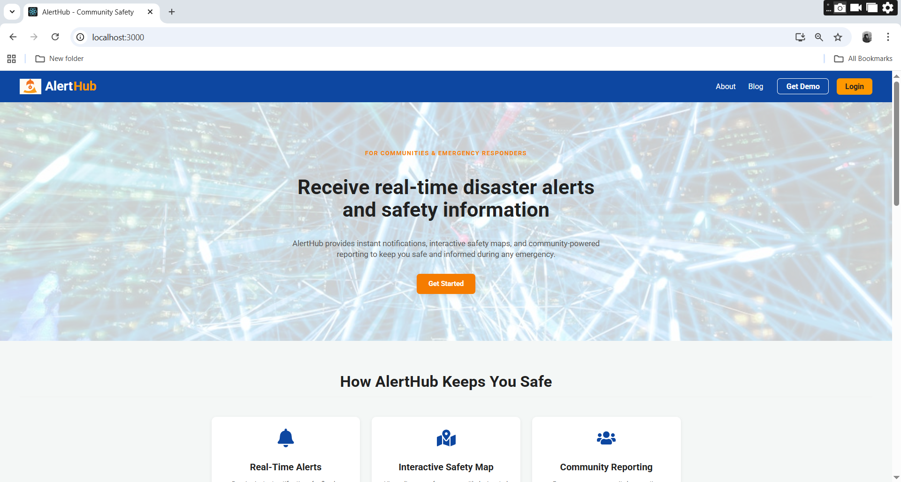
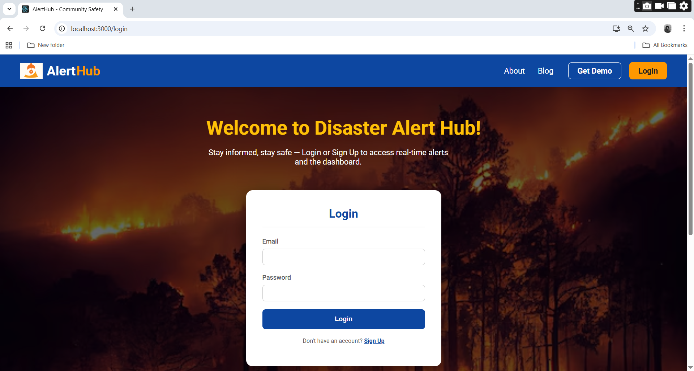
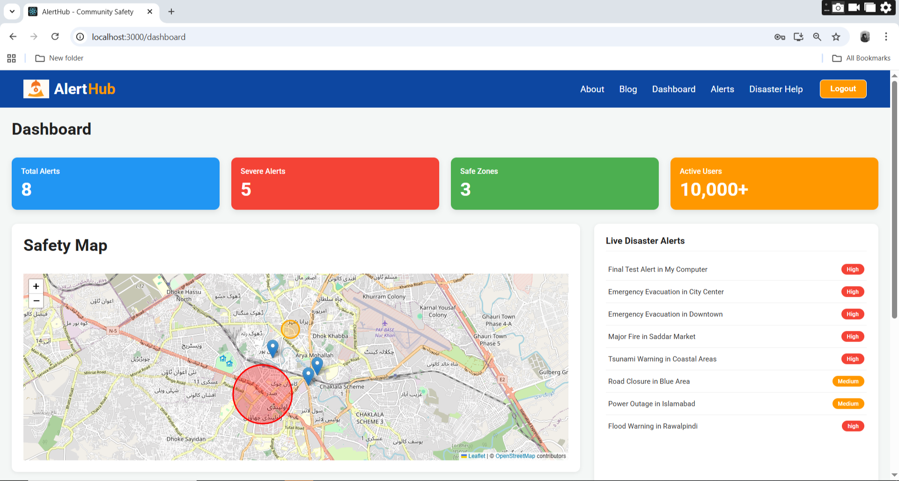
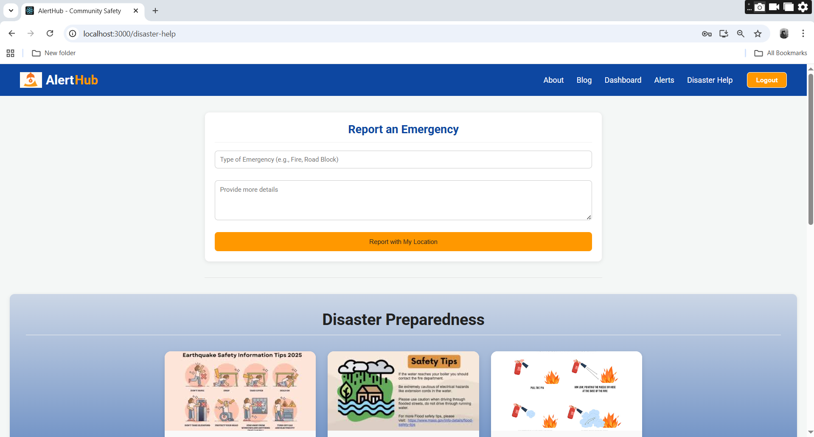

# AlertHub: A Community Disaster Alert & Safety Hub

### [▶️ Watch the Live Video Demo Here](demo/alert-hub-demo.mp4)

**AlertHub** is a comprehensive, real-time web application designed to solve the critical problem of delayed and scattered emergency information. It provides a single, reliable source of truth for citizens and emergency responders during crises like floods, earthquakes, and fires.

This project was developed as a practical, social-good solution using a modern tech stack to deliver a secure, responsive, and user-friendly experience.

---

### **Live Screenshots**

| Homepage | Login Screen |
| :---: | :---: |
|  |  |
| **Dashboard** | **Disaster Help & Preparedness** |
|  |  |

---

### **Project Implementation in Detail**

To bring this project to life, I performed the following key actions:

*   **I set up a React frontend using Create React App** to build a fast, component-based, and responsive user interface for the entire application.
*   **I built the backend and database using Firebase.** I chose Firebase for its powerful real-time capabilities (Firestore) and built-in secure user management (Authentication), which were perfect for the project's requirements.
*   **I architected a full multi-page website using React Router.** This allowed me to create a professional site structure with a public-facing homepage, a secure login/signup portal, and several protected pages for authenticated users.
*   **I built a complete user authentication flow with Firebase Authentication**, allowing users to sign up for a new account and log in securely. My code handles errors for incorrect passwords, weak passwords, and existing users.
*   **I created a "Protected Routes" system.** This ensures that critical pages like the Dashboard and Disaster Help are only accessible to users who have successfully logged in.
*   **I developed a real-time "Live Alerts" feed.** By using Firestore's `onSnapshot` listener, I made it so new disaster alerts created in the database appear on the user's screen instantly without needing a page refresh.
*   **I integrated an interactive map using Leaflet.js.** The map fetches and displays both **safe zones** (hospitals, shelters) and **danger zones** (colored circles) from two separate Firebase collections.
*   **I built a functional "Emergency Reporting" form.** This form uses the browser's Geolocation API to capture a user's precise coordinates and saves the complete report to the database.
*   **I implemented a simulated SMS notification system.** I built a client-side listener that watches for new, high-severity alerts and triggers a browser pop-up and a database log, successfully demonstrating the core logic of an automated notification system without requiring a paid backend plan.

---

### **Tech Stack**

*   **Frontend:** React, React Router, CSS3
*   **Backend & Database:** Firebase (Firestore & Authentication)
*   **Mapping:** Leaflet.js
*   **Icons:** React Icons

### **Setup & Installation**

To run this project locally:

1.  Clone the repository: `git clone <your-repo-url>`
2.  Navigate to the project directory: `cd disaster-alert-hub`
3.  Install dependencies: `npm install`
4.  Create a `firebase.js` file in the `src/` directory and add your Firebase project configuration.
5.  Start the development server: `npm start`